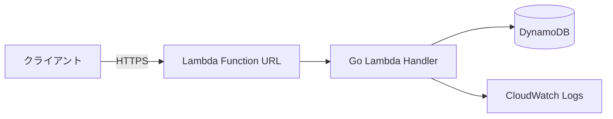

# 1. 概要 (Summary)

<!-- このサービス / 機能を 3〜5行で説明する。「何を」「誰のために」「どう解決するか」 -->

- **What**: bottlediverの公式ウェブサイト(https://www.bottlediver.com) が利用するバックエンドサービス。フロント向けの各データ一覧を返すAPIおよび管理画面向けのCRUD操作APIを提供する。
- **Why**: 更新/管理コストの削減。
- **Who (利用者)**: 管理者およびフロントエンドサービス
- **Non-goals**: UIの提供/各ドキュメントに対して`一覧,作成,個別更新,個別削除`のAPI以外の機能

# 2. 背景・目的 (Background & Goals)

略

# 3. 用語定義 (Glossary)

略

# 4. アーキテクチャ全体像 (Architecture Overview)

## 4.1 構成図

<!-- ASCII図 または Mermaid。外部システムとの境界を必ず描く -->



## 4.2 コンポーネント一覧

| コンポーネント      | 役割 | 備考 |
| ------------------- | ---- | ---- |
| Lambda Function URL |      |      |
| Lambda 関数         |      |      |
| DynamoDB テーブル   |      |      |

## 4.3 リクエストフロー

<!-- 主要ユースケース1つを step-by-step で書く -->

`News, Discography, Live, Video`のそれぞれについて

1. フロントエンド/管理画面からの一覧取得リクエスト
2. 管理画面からの新規作成リクエスト
3. 管理画面からの削除リクエスト
4. 管理画面からの個別編集リクエスト

# 5. API 設計 (API Specification)

## 5.1 共通仕様

- ベースURL: `https://<lambda-url>.lambda-url.<region>.on.aws/`
- 認証方式: <Function URL AuthType: NONE> + <アプリ層Basic認証> + <CORSでフロントエンドサービスのドメインを許可>
- リクエスト形式: `application/json; charset=utf-8`
- 文字コード: UTF-8
- 日時形式: RFC3339 (`2026-01-02T15:04:05Z`)
- タイムゾーン: UTC で受け渡し / 表示は呼び出し側で変換
- `image` フィールドは `null` / キー欠損 / 空文字列を同一の「未設定」として扱う。値が入る場合のみ URL 形式を検証する

## 5.2 共通エラーレスポンス

```json
{
  "error": {
    "code": "INVALID_ARGUMENT",
    "message": "human readable message",
    "details": []
  },
  "request_id": "<X-Request-Id>"
}
```

| HTTP | code               | 用途                  |
| ---- | ------------------ | --------------------- |
| 400  | INVALID_ARGUMENT   | バリデーション違反    |
| 401  | UNAUTHENTICATED    | 認証情報なし/無効     |
| 403  | PERMISSION_DENIED  | 認可エラー            |
| 404  | NOT_FOUND          | リソース不在          |
| 409  | CONFLICT           | 楽観ロック / 一意制約 |
| 429  | RESOURCE_EXHAUSTED | レート制限            |
| 500  | INTERNAL           | 想定外エラー          |

## 5.3 エンドポイント一覧

| Method | Path              | 概要                                               | 認可 |
| ------ | ----------------- | -------------------------------------------------- | ---- |
| GET    | /news             | 一覧を新しい順で取得する(ない場合は空の配列を返す) |      |
| POST   | /news             | 新たなドキュメントを作成する                       |      |
| PUT    | /news/{id}        | dynamoDBのSKを指定してドキュメントを更新する       |      |
| DELETE | /news/{id}        | dynamoDBのSKを指定してドキュメントを削除する       |      |
| GET    | /discography      | 一覧を新しい順で取得する(ない場合は空の配列を返す) |      |
| POST   | /discography      | 新たなドキュメントを作成する                       |      |
| PUT    | /discography/{id} | dynamoDBのSKを指定してドキュメントを更新する       |      |
| DELETE | /discography/{id} | dynamoDBのSKを指定してドキュメントを削除する       |      |
| GET    | /live             | 一覧を新しい順で取得する(ない場合は空の配列を返す) |      |
| POST   | /live             | 新たなドキュメントを作成する                       |      |
| PUT    | /live/{id}        | dynamoDBのSKを指定してドキュメントを更新する       |      |
| DELETE | /live/{id}        | dynamoDBのSKを指定してドキュメントを削除する       |      |
| GET    | /video            | 一覧を新しい順で取得する(ない場合は空の配列を返す) |      |
| POST   | /video            | 新たなドキュメントを作成する                       |      |
| PUT    | /video/{id}       | dynamoDBのSKを指定してドキュメントを更新する       |      |
| DELETE | /video/{id}       | dynamoDBのSKを指定してドキュメントを削除する       |      |

## 5.4 エンドポイント詳細

> `{id}` はすべて DynamoDB の SK である `timestamp`（UNIX時間ミリ秒を文字列化した値）を指す。

---

### 5.4.1 `GET /news`

- **概要**: News 一覧を取得する
- **認可**: なし（公開）
- **冪等性**: あり

#### Request

- Path Parameters: なし
- Query Parameters: なし
- Body: なし

#### Response (200)

```json
{
  "items": [
    {
      "id": "1746187200000",
      "title": "2030.01.01 - 1st Album 『hogehoge』リリース決定",
      "image": "https://example.com/image.jpg",
      "content": "ニュース本文を記載"
    }
  ]
}
```

#### エラーパターン

| 条件    | HTTP | code     |
| ------- | ---- | -------- |
| DB 障害 | 500  | INTERNAL |

---

### 5.4.2 `POST /news`

- **概要**: News ドキュメントを新規作成する
- **認可**: Basic 認証必須
- **冪等性**: なし（timestamp を作成時点で発行）

#### Request

- Headers:
  | name | required | 説明 |
  | ---- | -------- | ---- |
  | Authorization | ✓ | `Basic <base64>` |
- Body:
  ```json
  {
    "title": "2030.01.01 - 1st Album 『hogehoge』リリース決定",
    "image": "https://example.com/image.jpg",
    "content": "ニュース本文を記載"
  }
  ```

| フィールド | 型     | 必須 | バリデーション |
| ---------- | ------ | ---- | -------------- |
| title      | string | ✓    | 1〜200文字     |
| image      | string |      | URL形式        |
| content    | string | ✓    | 最大10000文字  |

#### Response (201)

```json
{
  "id": "1746187200000",
  "title": "2030.01.01 - 1st Album 『hogehoge』リリース決定",
  "image": "https://example.com/image.jpg",
  "content": "ニュース本文を記載"
}
```

#### エラーパターン

| 条件               | HTTP | code             |
| ------------------ | ---- | ---------------- |
| 認証情報なし/不正  | 401  | UNAUTHENTICATED  |
| バリデーション違反 | 400  | INVALID_ARGUMENT |
| DB 障害            | 500  | INTERNAL         |

---

### 5.4.3 `PUT /news/{id}`

- **概要**: 指定した News ドキュメントを更新する
- **認可**: Basic 認証必須
- **冪等性**: あり（同一ボディで繰り返し呼んでも結果は同じ）

#### Request

- Path Parameters:
  | name | type | required | 説明 |
  | ---- | ---- | -------- | ---- |
  | id | string | ✓ | timestamp SK（ミリ秒） |
- Headers:
  | name | required | 説明 |
  | ---- | -------- | ---- |
  | Authorization | ✓ | `Basic <base64>` |
- Body:
  ```json
  {
    "title": "2030.01.01 - 1st Album 『hogehoge』リリース決定",
    "image": "https://example.com/image.jpg",
    "content": "ニュース本文を記載"
  }
  ```

| フィールド | 型     | 必須 | バリデーション |
| ---------- | ------ | ---- | -------------- |
| title      | string | ✓    | 1〜200文字     |
| image      | string |      | URL形式        |
| content    | string | true | 最大10000文字  |

#### Response (200)

```json
{
  "id": "1746187200000",
  "title": "2030.01.01 - 1st Album 『hogehoge』リリース決定",
  "image": "https://example.com/image.jpg",
  "content": "ニュース本文を記載"
}
```

#### エラーパターン

| 条件                 | HTTP | code             |
| -------------------- | ---- | ---------------- |
| 認証情報なし/不正    | 401  | UNAUTHENTICATED  |
| バリデーション違反   | 400  | INVALID_ARGUMENT |
| 指定 id が存在しない | 404  | NOT_FOUND        |
| DB 障害              | 500  | INTERNAL         |

---

### 5.4.4 `DELETE /news/{id}`

- **概要**: 指定した News ドキュメントを削除する
- **認可**: Basic 認証必須
- **冪等性**: あり

#### Request

- Path Parameters:
  | name | type | required | 説明 |
  | ---- | ---- | -------- | ---- |
  | id | string | ✓ | timestamp SK（ミリ秒） |
- Headers:
  | name | required | 説明 |
  | ---- | -------- | ---- |
  | Authorization | ✓ | `Basic <base64>` |
- Body: なし

#### Response (204)

ボディなし

#### エラーパターン

| 条件                 | HTTP | code            |
| -------------------- | ---- | --------------- |
| 認証情報なし/不正    | 401  | UNAUTHENTICATED |
| 指定 id が存在しない | 404  | NOT_FOUND       |
| DB 障害              | 500  | INTERNAL        |

---

### 5.4.5 `GET /discography`

- **概要**: Discography 一覧を取得する
- **認可**: なし（公開）
- **冪等性**: あり

#### Request

- Path Parameters: なし
- Query Parameters: なし
- Body: なし

#### Response (200)

```json
{
  "items": [
    {
      "id": "1746187200000",
      "title": "1st Album 『Scrawl』",
      "image": "https://example.com/image.jpg",
      "musics": ["一閃", "STROBE", "透明人間"],
      "applemusic_link": "https://music.apple.com/...",
      "spotify_link": "https://open.spotify.com/...",
      "youtubemusic_link": "https://music.youtube.com/...",
      "linemusic_link": "https://music.line.me/...",
      "amazonmusic_link": "https://music.amazon.co.jp/..."
    }
  ]
}
```

#### エラーパターン

| 条件    | HTTP | code     |
| ------- | ---- | -------- |
| DB 障害 | 500  | INTERNAL |

---

### 5.4.6 `POST /discography`

- **概要**: Discography ドキュメントを新規作成する
- **認可**: Basic 認証必須
- **冪等性**: なし

#### Request

- Headers:
  | name | required | 説明 |
  | ---- | -------- | ---- |
  | Authorization | ✓ | `Basic <base64>` |
- Body:
  ```json
  {
    "title": "1st Album 『Scrawl』",
    "image": "https://example.com/image.jpg",
    "musics": ["一閃", "STROBE", "透明人間"],
    "applemusic_link": "https://music.apple.com/...",
    "spotify_link": "https://open.spotify.com/...",
    "youtubemusic_link": "https://music.youtube.com/...",
    "linemusic_link": "https://music.line.me/...",
    "amazonmusic_link": "https://music.amazon.co.jp/..."
  }
  ```

| フィールド        | 型       | 必須 | バリデーション   |
| ----------------- | -------- | ---- | ---------------- |
| title             | string   | ✓    | 1〜200文字       |
| image             | string   |      | URL形式          |
| musics            | string[] | true | 各要素1〜200文字 |
| applemusic_link   | string   | true | URL形式          |
| spotify_link      | string   | true | URL形式          |
| youtubemusic_link | string   | true | URL形式          |
| linemusic_link    | string   | true | URL形式          |
| amazonmusic_link  | string   | true | URL形式          |

#### Response (201)

```json
{
  "id": "1746187200000",
  "title": "1st Album 『Scrawl』",
  "image": "https://example.com/image.jpg",
  "musics": ["一閃", "STROBE", "透明人間"],
  "applemusic_link": "https://music.apple.com/...",
  "spotify_link": "https://open.spotify.com/...",
  "youtubemusic_link": "https://music.youtube.com/...",
  "linemusic_link": "https://music.line.me/...",
  "amazonmusic_link": "https://music.amazon.co.jp/...""
}
```

#### エラーパターン

| 条件               | HTTP | code             |
| ------------------ | ---- | ---------------- |
| 認証情報なし/不正  | 401  | UNAUTHENTICATED  |
| バリデーション違反 | 400  | INVALID_ARGUMENT |
| DB 障害            | 500  | INTERNAL         |

---

### 5.4.7 `PUT /discography/{id}`

- **概要**: 指定した Discography ドキュメントを更新する
- **認可**: Basic 認証必須
- **冪等性**: あり

#### Request

- Path Parameters:
  | name | type | required | 説明 |
  | ---- | ---- | -------- | ---- |
  | id | string | ✓ | timestamp SK（ミリ秒） |
- Headers:
  | name | required | 説明 |
  | ---- | -------- | ---- |
  | Authorization | ✓ | `Basic <base64>` |
- Body: 5.4.6 と同じスキーマ

#### Response (200)

5.4.6 のレスポンスと同じスキーマ

#### エラーパターン

| 条件                 | HTTP | code             |
| -------------------- | ---- | ---------------- |
| 認証情報なし/不正    | 401  | UNAUTHENTICATED  |
| バリデーション違反   | 400  | INVALID_ARGUMENT |
| 指定 id が存在しない | 404  | NOT_FOUND        |
| DB 障害              | 500  | INTERNAL         |

---

### 5.4.8 `DELETE /discography/{id}`

- **概要**: 指定した Discography ドキュメントを削除する
- **認可**: Basic 認証必須
- **冪等性**: あり

#### Request

- Path Parameters:
  | name | type | required | 説明 |
  | ---- | ---- | -------- | ---- |
  | id | string | ✓ | timestamp SK（ミリ秒） |
- Headers:
  | name | required | 説明 |
  | ---- | -------- | ---- |
  | Authorization | ✓ | `Basic <base64>` |
- Body: なし

#### Response (204)

ボディなし

#### エラーパターン

| 条件                 | HTTP | code            |
| -------------------- | ---- | --------------- |
| 認証情報なし/不正    | 401  | UNAUTHENTICATED |
| 指定 id が存在しない | 404  | NOT_FOUND       |
| DB 障害              | 500  | INTERNAL        |

---

### 5.4.9 `GET /live`

- **概要**: Live 一覧を取得する
- **認可**: なし（公開）
- **冪等性**: あり

#### Request

- Path Parameters: なし
- Query Parameters: なし
- Body: なし

#### Response (200)

```json
{
  "items": [
    {
      "id": "1746187200000",
      "title": "2026.5.14 - Fireloop presents overplugged",
      "image": "https://example.com/image.jpg",
      "where": "寺田町Fireloop",
      "with": ["band A", "バンドB", "Band 01"],
      "ticket": "ADV ¥2400 / DOOR ¥2400",
      "time": "OPEN: 18:00 / START: 18:30",
      "link": "https://example.com/live-detail"
    }
  ]
}
```

#### エラーパターン

| 条件    | HTTP | code     |
| ------- | ---- | -------- |
| DB 障害 | 500  | INTERNAL |

---

### 5.4.10 `POST /live`

- **概要**: Live ドキュメントを新規作成する
- **認可**: Basic 認証必須
- **冪等性**: なし

#### Request

- Headers:
  | name | required | 説明 |
  | ---- | -------- | ---- |
  | Authorization | ✓ | `Basic <base64>` |
- Body:
  ```json
  {
    "title": "2026.5.14 - Fireloop presents overplugged",
    "image": "https://example.com/image.jpg",
    "where": "寺田町Fireloop",
    "with": ["band A", "バンドB", "Band 01"],
    "ticket": "ADV ¥2400 / DOOR ¥2400",
    "time": "OPEN: 18:00 / START: 18:30",
    "link": "https://example.com/live-detail"
  }
  ```

| フィールド | 型       | 必須 | バリデーション   |
| ---------- | -------- | ---- | ---------------- |
| title      | string   | ✓    | 1〜200文字       |
| image      | string   |      | URL形式          |
| where      | string   | true | 最大200文字      |
| with       | string[] | true | 各要素1〜200文字 |
| ticket     | string   | true | 最大200文字      |
| time       | string   | true | 最大100文字      |
| link       | string   | true | URL形式          |

#### Response (201)

```json
{
  "id": "1746187200000",
  "title": "2026.5.14 - Fireloop presents overplugged",
  "image": "https://example.com/image.jpg",
  "where": "寺田町Fireloop",
  "with": ["band A", "バンドB", "Band 01"],
  "ticket": "ADV ¥2400 / DOOR ¥2400",
  "time": "OPEN: 18:00 / START: 18:30",
  "link": "https://example.com/live-detail"
}
```

#### エラーパターン

| 条件               | HTTP | code             |
| ------------------ | ---- | ---------------- |
| 認証情報なし/不正  | 401  | UNAUTHENTICATED  |
| バリデーション違反 | 400  | INVALID_ARGUMENT |
| DB 障害            | 500  | INTERNAL         |

---

### 5.4.11 `PUT /live/{id}`

- **概要**: 指定した Live ドキュメントを更新する
- **認可**: Basic 認証必須
- **冪等性**: あり

#### Request

- Path Parameters:
  | name | type | required | 説明 |
  | ---- | ---- | -------- | ---- |
  | id | string | ✓ | timestamp SK（ミリ秒） |
- Headers:
  | name | required | 説明 |
  | ---- | -------- | ---- |
  | Authorization | ✓ | `Basic <base64>` |
- Body: 5.4.10 と同じスキーマ

#### Response (200)

5.4.10 のレスポンスと同じスキーマ

#### エラーパターン

| 条件                 | HTTP | code             |
| -------------------- | ---- | ---------------- |
| 認証情報なし/不正    | 401  | UNAUTHENTICATED  |
| バリデーション違反   | 400  | INVALID_ARGUMENT |
| 指定 id が存在しない | 404  | NOT_FOUND        |
| DB 障害              | 500  | INTERNAL         |

---

### 5.4.12 `DELETE /live/{id}`

- **概要**: 指定した Live ドキュメントを削除する
- **認可**: Basic 認証必須
- **冪等性**: あり

#### Request

- Path Parameters:
  | name | type | required | 説明 |
  | ---- | ---- | -------- | ---- |
  | id | string | ✓ | timestamp SK（ミリ秒） |
- Headers:
  | name | required | 説明 |
  | ---- | -------- | ---- |
  | Authorization | ✓ | `Basic <base64>` |
- Body: なし

#### Response (204)

ボディなし

#### エラーパターン

| 条件                 | HTTP | code            |
| -------------------- | ---- | --------------- |
| 認証情報なし/不正    | 401  | UNAUTHENTICATED |
| 指定 id が存在しない | 404  | NOT_FOUND       |
| DB 障害              | 500  | INTERNAL        |

---

### 5.4.13 `GET /video`

- **概要**: Video 一覧を取得する
- **認可**: なし（公開）
- **冪等性**: あり

#### Request

- Path Parameters: なし
- Query Parameters: なし
- Body: なし

#### Response (200)

```json
{
  "items": [
    {
      "id": "1746187200000",
      "title": "[Live video] 未明 - bottle diver",
      "link": "https://www.youtube.com/watch?v=..."
    }
  ]
}
```

#### エラーパターン

| 条件    | HTTP | code     |
| ------- | ---- | -------- |
| DB 障害 | 500  | INTERNAL |

---

### 5.4.14 `POST /video`

- **概要**: Video ドキュメントを新規作成する
- **認可**: Basic 認証必須
- **冪等性**: なし

#### Request

- Headers:
  | name | required | 説明 |
  | ---- | -------- | ---- |
  | Authorization | ✓ | `Basic <base64>` |
- Body:
  ```json
  {
    "title": "[Live video] 未明 - bottle diver",
    "link": "https://www.youtube.com/watch?v=..."
  }
  ```

| フィールド | 型     | 必須 | バリデーション |
| ---------- | ------ | ---- | -------------- |
| title      | string | ✓    | 1〜200文字     |
| link       | string | ✓    | URL形式        |

#### Response (201)

```json
{
  "id": "1746187200000",
  "title": "[Live video] 未明 - bottle diver",
  "link": "https://www.youtube.com/watch?v=..."
}
```

#### エラーパターン

| 条件               | HTTP | code             |
| ------------------ | ---- | ---------------- |
| 認証情報なし/不正  | 401  | UNAUTHENTICATED  |
| バリデーション違反 | 400  | INVALID_ARGUMENT |
| DB 障害            | 500  | INTERNAL         |

---

### 5.4.15 `PUT /video/{id}`

- **概要**: 指定した Video ドキュメントを更新する
- **認可**: Basic 認証必須
- **冪等性**: あり

#### Request

- Path Parameters:
  | name | type | required | 説明 |
  | ---- | ---- | -------- | ---- |
  | id | string | ✓ | timestamp SK（ミリ秒） |
- Headers:
  | name | required | 説明 |
  | ---- | -------- | ---- |
  | Authorization | ✓ | `Basic <base64>` |
- Body: 5.4.14 と同じスキーマ

#### Response (200)

5.4.14 のレスポンスと同じスキーマ

#### エラーパターン

| 条件                 | HTTP | code             |
| -------------------- | ---- | ---------------- |
| 認証情報なし/不正    | 401  | UNAUTHENTICATED  |
| バリデーション違反   | 400  | INVALID_ARGUMENT |
| 指定 id が存在しない | 404  | NOT_FOUND        |
| DB 障害              | 500  | INTERNAL         |

---

### 5.4.16 `DELETE /video/{id}`

- **概要**: 指定した Video ドキュメントを削除する
- **認可**: Basic 認証必須
- **冪等性**: あり

#### Request

- Path Parameters:
  | name | type | required | 説明 |
  | ---- | ---- | -------- | ---- |
  | id | string | ✓ | timestamp SK（ミリ秒） |
- Headers:
  | name | required | 説明 |
  | ---- | -------- | ---- |
  | Authorization | ✓ | `Basic <base64>` |
- Body: なし

#### Response (204)

ボディなし

#### エラーパターン

| 条件                 | HTTP | code            |
| -------------------- | ---- | --------------- |
| 認証情報なし/不正    | 401  | UNAUTHENTICATED |
| 指定 id が存在しない | 404  | NOT_FOUND       |
| DB 障害              | 500  | INTERNAL        |

# 6. データモデル / DynamoDB 設計 (Data Model)

## 6.1 設計方針

- テーブル戦略: シングルテーブル/PKでドキュメントの種類を判別
- キャパシティモード: On-Demand

## 6.2 アクセスパターン一覧

<!-- 設計の起点。先にこの表を埋めてからキー設計に入る -->

| #   | ユースケース         | 対応エンドポイント         | DynamoDB 操作 | 条件                                 |
| --- | -------------------- | -------------------------- | ------------- | ------------------------------------ |
| 1   | News 一覧取得        | `GET /news`                | Query         | PK = `type=1`                        |
| 2   | News 作成            | `POST /news`               | PutItem       | PK = `type=1`, SK = 現在時刻(ms)     |
| 3   | News 更新            | `PUT /news/{id}`           | UpdateItem    | PK = `type=1`, SK = `timestamp={id}` |
| 4   | News 削除            | `DELETE /news/{id}`        | DeleteItem    | PK = `type=1`, SK = `timestamp={id}` |
| 5   | Discography 一覧取得 | `GET /discography`         | Query         | PK = `type=2`                        |
| 6   | Discography 作成     | `POST /discography`        | PutItem       | PK = `type=2`, SK = 現在時刻(ms)     |
| 7   | Discography 更新     | `PUT /discography/{id}`    | UpdateItem    | PK = `type=2`, SK = `timestamp={id}` |
| 8   | Discography 削除     | `DELETE /discography/{id}` | DeleteItem    | PK = `type=2`, SK = `timestamp={id}` |
| 9   | Live 一覧取得        | `GET /live`                | Query         | PK = `type=3`                        |
| 10  | Live 作成            | `POST /live`               | PutItem       | PK = `type=3`, SK = 現在時刻(ms)     |
| 11  | Live 更新            | `PUT /live/{id}`           | UpdateItem    | PK = `type=3`, SK = `timestamp={id}` |
| 12  | Live 削除            | `DELETE /live/{id}`        | DeleteItem    | PK = `type=3`, SK = `timestamp={id}` |
| 13  | Video 一覧取得       | `GET /video`               | Query         | PK = `type=4`                        |
| 14  | Video 作成           | `POST /video`              | PutItem       | PK = `type=4`, SK = 現在時刻(ms)     |
| 15  | Video 更新           | `PUT /video/{id}`          | UpdateItem    | PK = `type=4`, SK = `timestamp={id}` |
| 16  | Video 削除           | `DELETE /video/{id}`       | DeleteItem    | PK = `type=4`, SK = `timestamp={id}` |

**補足:**

- 一覧取得 (Query) は PK のみ指定。SK の範囲絞り込みや Limit は不要。
- 更新・削除は SK で 1 件を特定するため、存在確認が必要（NOT_FOUND を返す場合は `ConditionExpression` を使う）。
- PutItem (作成) は SK = 現在時刻(ms) のため衝突はほぼ発生しないが、厳密に防ぐ場合は `attribute_not_exists(#timestamp)` の ConditionExpression を付与する。

## 6.3 テーブル定義

### Table: `bottlediver`

- Partition Key: `type` (数値/news:1,discography:2,live:3,video:4)
- Sort Key: `timestamp` (数値/UNIXタイム,ミリ秒)
- `L` 型の要素はすべて文字列とする
- Attributes:

| 属性              | 型  | 必須 | 説明                                                  |
| ----------------- | --- | ---- | ----------------------------------------------------- |
| type              | N   | ✓    | パーティションキー                                    |
| timestamp         | N   | ✓    | ソートキー:作成時のタイムスタンプ                     |
| title             | S   | ✓    | タイトル(全オブジェクト共通)                          |
| image             | S   |      | news,discography,live/画像URL                         |
| content           | S   |      | news/本文                                             |
| musics            | L   |      | discography/収録曲リスト(文字列List)                  |
| applemusic_link   | S   |      | discography/applemusic用link                          |
| spotify_link      | S   |      | discography/spotify用link                             |
| youtubemusic_link | S   |      | discography/youtubemusic用link                        |
| linemusic_link    | S   |      | discography/linemusic用link                           |
| amazonmusic_link  | S   |      | discography/amazonmusic用link                         |
| where             | S   |      | live/会場                                             |
| with              | L   |      | live/ゲストバンド一覧(文字列List)                     |
| ticket            | S   |      | live/チケット料金文字列(ex: "ADV ¥2400 / DOOR ¥2400") |
| time              | S   |      | 開演時間文字列(ex: "OPEN: 18:00 / START: 18:30")      |
| link              | S   |      | live/詳細リンク, video/youtubeリンク                  |

## 6.4 整合性・トランザクション

- 今回は考慮しない

# 7. Lambda 設計 (Lambda Design)

## 7.1 関数構成

- 粒度: 単一のGo製HTTPサーバーとして実装
- ランタイム: `provided.al2023` (Go custom runtime)
- アーキテクチャ: `arm64`（コスト・性能の理由により既定）

## 7.2 エントリポイント

```go
// cmd/api/main.go
func main() {
    lambda.Start(handler)
}
```

## 7.3 レイヤ責務

- `handler` はリクエストのデコードとバリデーションのみを担当し、ドメインロジックや `repository` 操作は行わない
- `usecase` はドメインモデルの生成・更新、業務ルールの適用、`repository` の呼び出しを担当する
- `repository` は DynamoDB との入出力と永続化表現への変換を担当する

# 8. 認証・認可 (AuthN / AuthZ)

## 8.1 認証

<!-- 例: Cognito User Pools / 自前JWT / API Key / Function URL IAM署名 -->

- 方式: Basic認証
- 認証情報管理: 環境変数

# 9. 横断的関心事 (Cross-cutting Concerns)

## 9.1 ロギング

- ライブラリ: `log/slog`（JSON ハンドラ）
- 出力先: CloudWatch Logs
- 必須フィールド: エンドポイント, リクエストボディ, レスポンス, DBクエリ, DBレスポンス

# 10. セキュリティ (Security)

略

# 11. 性能・スケーラビリティ

- 想定 RPS: 1
- 想定レイテンシ (p95): 1000ms
- コールドスタート対策: 不要

# 12. テスト戦略

| レイヤ    | 対象                                   | ツール    |
| --------- | -------------------------------------- | --------- |
| handler   | リクエストデコード、入力バリデーション | `go test` |
| usecase   | ドメインロジック、業務ルール           | `go test` |

- `handler` のテストでは `usecase` をスタブ/モックし、バリデーション結果と HTTP レスポンスのみを検証する
- `usecase` のテストでは `repository` をモックし、ドメインモデル操作と永続化呼び出しを検証する

# 13. デプロイ・運用

## 13.1 ビルド

```bash
GOOS=linux GOARCH=arm64 go build -tags lambda.norpc -o bootstrap ./cmd/api
zip -j function.zip bootstrap
```

# 14. ディレクトリ構成 (案)

```
.
├── cmd/
│   └── api/
│       └── main.go            # Lambda エントリポイント
├── internal/
│   ├── handler/               # HTTP ハンドラ
│   ├── usecase/               # ユースケース層
│   ├── domain/                # エンティティ / ドメインエラー
│   ├── repository/            # DynamoDB アクセス
├── docs/
│   └── api-design.md              # 本書
├── go.mod
├── go.sum
└── README.md
```
